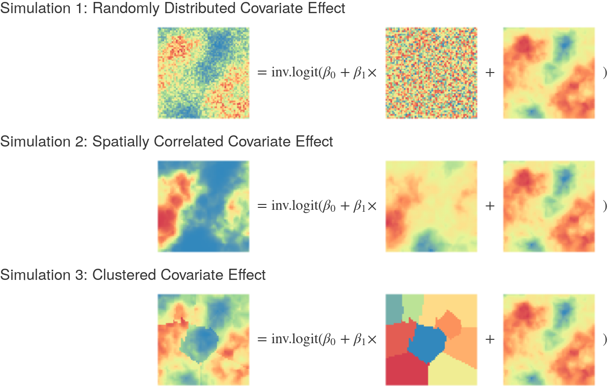

```{r setup, include=FALSE}
knitr::opts_chunk$set(echo = FALSE, warning = FALSE, message = FALSE, fig.height=4, dev='svg')
```

```{r include=FALSE}
library(ggplot2)
samplePlots <- readRDS(
    "~/Documents/PointPolygon/demo/plotsForPresent.Rds")

resultsPlotsDR <- readRDS(
    "~/Documents/PointPolygon/demo/aggplotsDR.Rds")

resultsPlots <- readRDS(
    "~/Documents/PointPolygon/demo/aggplots.Rds")
```

# Background

- For countries without comprehensive Vital Registration data accurate use of survey data is essential for estimating child mortality
- Data come to us at different spatial resolutions and if we believe the true underlying data generating process is continuous then administrative data is problematic for traditional geospatial models
- How can we effectively/accurately incorporate different spatial resolution data into geospatial models

---

# Data Example


---

# Data Example
- Historically incomplete VR for child births and deaths
- Number of surveys on complete birth history (CBH)
- DHS 2007 & 2013: Complete Spatial information given for CBH
- MICS 2014: Cluster location removed for CBH know only up to stratification

---

# Previous Approaches

- Golding et al 2017 (Resampling)
    - Pros: Uses all available data, applicable for all contexts
    - Cons: May distort the estimation of spatial correlation
- Utazi et al 2018 (RHS Integration with ICAR)
    - Pros: Uses all available data, applicable for all contexts
    - Cons: Built in ecological fallacy and strange non linearity
- Wilson et al 2018 (MCMC in INLA)
    - Pros: Correctly captures the data generating process
    - Cons: Slow to implement and potential privacy issues
- No substantive cross comparison between models evaluating performance

---

# New Proposal: Mixture Model

$$Y_i \sim \text{Binomial}(p_{s_i, t_i}, N_i) \\ \text{logit}(p_{s_i, t_i}) = \boldsymbol{\beta \cdot X_{s_i, t_i}} + \omega(s_i, t_i) \\ \boldsymbol{\omega} \sim \mathcal{GP}(\boldsymbol{0}, \mathcal{M} \otimes\text{AR1}) \\ \boldsymbol{\omega}~\dot \sim~ \text{GMRF}(\boldsymbol{0}, Q^\mathcal{M} \otimes Q^\text{AR1})$$

---

# New Proposal: Mixture Model

$$Y^\star_i ~\dot \sim ~ \begin{cases} \text{Binomial}(p_{s_{j_1}, t_i}, N_i) \times q_{s_{j_1}}\\ \vdots \\ \text{Binomial}(p_{s_{j_J}, t_i}, N_i) \times q_{s_{j_J}} \\ \end{cases} \text{for } j \in \mathcal{A}_i \\ \text{logit}(p_{s_j, t_i}) = \boldsymbol{\beta \cdot X_{s_j, t_i}} + \omega(s_j, t_i) \\ \boldsymbol{\omega}~\dot \sim~ \text{GMRF}(\boldsymbol{0}, Q^\mathcal{M} \otimes Q^\text{AR1})$$

---

# New Proposal Alternative: Riemann

$$Y^\star_i ~\dot \sim ~ \text{Binomial}(\sum_{j \in \mathcal{A}} p_{s_{j}, t_i} \times q_{s_{j}, t_i}, N_i)\\ \text{logit}(p_{s_j, t_i}) = \boldsymbol{\beta \cdot X_{s_j, t_i}} + \omega(s_j, t_i) \\ \boldsymbol{\omega}~\dot \sim~ \text{GMRF}(\boldsymbol{0}, Q^\mathcal{M} \otimes Q^\text{AR1})$$

---

# Model Requirements
- Covariate space for entire area must be known  
- Must have a good sampling frame of population for time of sample
    - If known use enumeration areas
    - Population Raster is sufficient
- Relatively Large RAM requirements

---

# Model Comparison Framework: Simulated Field and Sampling
- Simulate a 2D Matern covariance process GP as the spatial field (1x1 grid)  
- Add in a covariate to the field which either is  
    - Spatially clustered  
    - Spatially correlated  
    - At random
- Sample from the field with known location  
- Sample from the field with unknown location up to a polygon

---

# Model Comparison Framework: Simulated Field


---

# Model Comparison Framework: Simulated Field Variation


---

# Model Comparison Framework: Sampling
```{r}
samplePlots$mixPlot
```

---

# Model Comparison Framework: Sampling
```{r}
samplePlots$ovPlot
```

---

# Model Comparison Framework: Candidate Models
 - Mixture Model  
 - Utazi Model  
 - Riemann Model  
 - Resampling Model
 - Ignore Polygon Model
 - Location Known Model (for Reference)

---

# Model Comparison Framework: Evaluation
 - RMSE of the probability field
 - Coverage of CI across the field
 - Bias
 - Bias for Dissimilarity Measure

---

# Model Results
```{r}
samplePlots$results
```

---

# Model Results
```{r}
samplePlots$resultsSD
```

---

# Model Results
```{r}
resultsPlots$rmseRelativeZoom
```

---

# Model Results
```{r}
resultsPlots$coverage
```

---

# Model Results
```{r}
resultsPlots$bias
```

---

# Model Results
```{r}
resultsPlots$dissDiff
```

---

# Simulation DR Context

- Simulate spatial-temporal field over 6 years across the DR ~(5x5km grid)
- Sample using DHS 2013 and MICS 2014 location information
- Simulate cluster locations for MICS within known stratification (Region/urbanicity)
- DHS: 370 clusters with 3256 person-years of Data
- Mics:  684 clusters of data with ~25,000 person years of data
- No Utazi model

---

# Dominican Republic Sampling
```{r}
samplePlots$fieldDR
```

---

# Dominican Republic Sampling
```{r}
samplePlots$fieldDR2
```

---

# Dominican Republic Sampling
```{r}
samplePlots$reg
```

---

# Dominican Republic Sampling
```{r}
samplePlots$regUR
```

---

# Model Results
```{r}
samplePlots$drResults
```

---

# Model Results
```{r}
samplePlots$drProvError
```

---

# Model Results
```{r}
resultsPlotsDR$rmseRelative
```

---

# Model Results
```{r}
resultsPlotsDR$rmseProvRelative
```

---

# Model Results
```{r}
resultsPlotsDR$bias
```

---

# Model Results
```{r}
resultsPlotsDR$provcoverage
```

---

# Model Results
```{r}
resultsPlotsDR$dissDiff
```

---

# Notes on Runtime
```{r}
resultsPlotsDR$runtime
```

---

# Conclusion
- New model provides significant improvement over IHME resampling
- Most tested models offer some improvement over resampling
- Cost of implementation for mixture model is high (runtime & RAM)  
- Riemann model offers a compromise in performance and resources  

---

# Limitations
- No model miss-specification tests  
- Unclear how different results are when applied to actual data
- Should test other countries  
- Need to vary temporal auto correlation  

---

class: inverse, center, middle

# Questions??
