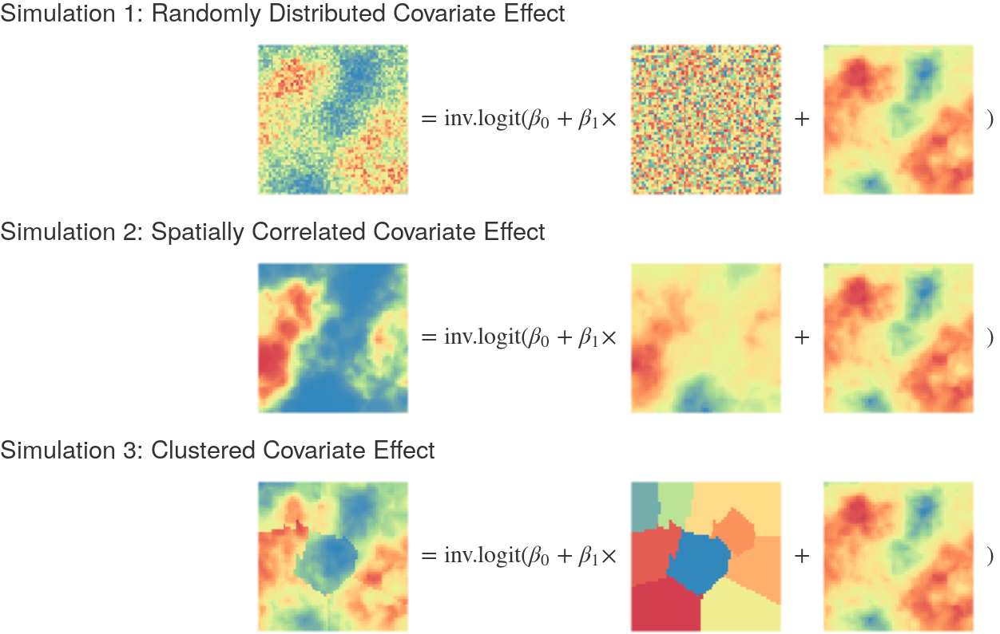

```{r setup, include=FALSE}
knitr::opts_chunk$set(echo = FALSE, warning = FALSE, message = FALSE, fig.height=4, dev='svg')
```

```{r include=FALSE}
library(ggplot2)
samplePlots <- readRDS(
    "~/Documents/PointPolygon/demo/plotsForPresent.Rds")

resultsPlotsDR <- readRDS(
    "~/Documents/PointPolygon/demo/aggplotsDR.Rds")

resultsPlots <- readRDS(
    "~/Documents/PointPolygon/demo/aggplots.Rds")
```


class: center, middle

# Background

---

# Child Mortality and the Millenium Development Goals

- "... the Persistence of disparities in infant mortality rates throughout this century, mirroring the persistence of larger social and economic inequalities in the United States" (Gormaker & Wise 1997)
- Child mortality as an indicator for
    - Maternal health
    - Access to care
    - General public health
    - Morbidity and early life adversity
- Millennium Development Goals (MDGs)
    - Reduce child mortality by two thirds

---

# The Lasting Effects of MDGs

- Comparative health-systems studies (Horton 2006)
    - The importance of strengthening health systems
    - Evidence based implementation
    - Strong importance on understanding data landscape
- Countdown to 2015 (Victoria et al 2016)
    - The importance of multiple stakeholders in monitoring processes
    - Linking interventions to health improvements
    - Planning for future goals

---
# Mexico: Changes in Under Five Mortality


---
# Limitations of the National Context: Inequality

- Country level studies mask variation within the country (Hosseinpoor 2016)
    - Need for unmasking geographic differences in health
    - Deploy equity oriented interventions
- Precision public health (Desmond-Hellmann 2016)
- Recent studies point to growing levels of health inequalities by sub-national measures
    - Rising inequality in United States county level mortality (Dwyer-Lindgren 2017)
    - Differential gains in Sub-Saharan Africa under five mortality (Burke 2016)

---
# Evidence of Growing Health Inequality


---
# Spatial Analysis of Under 5 Mortality

- Leverage spatial auto-correlation in health events to get better informed estimates
- Classic example Clayton and Kaldor 1987 Socttish Lip Cancer

---
# Example of Spatial Smoothing


---
# Spatial Analysis of Under 5 Mortality

- Leverage spatial auto-correlation in health events to get better informed estimates
- Classic example Clayton and Kaldor 1987 Socttish Lip Cancer
    - Pooling information across space improves estimates
    - Different observations give us different levels of information
    - Similar things tend to cluster in space

---
# Spatial Mechenisms of Health Outcomes
- Access to health facilities
- Neighborhood characteristics and early life adversity
- Clustered socio-economic characteristics
    - Quality of education
    - Economic standing
    - [Racial/ethnic clustering](https://demographics.virginia.edu/DotMap/index.html)

---
# Limitations to Current Analysis of Geospatial Child Mortality
- Data must be sufficiently geolocated
    - Known enumeration areas from MICS/DHS
    - Geolocated data points
- Data must come in the form of complete birth histories
    - Summary birth histories
    - Vital Registration may also be used if comprehensive
- Data must be representative of the locations they sample

---
# DHS and MICS Studies
- United States Agency for International Development / UNICEF funded
- Monitor changes in health in developing countries
    - Countries that do not have comprehensive registration systems
- Collect data on a number of health indicators including CBH of women in households
- Relatively small portion of the data is geolocated
    - 25% of person years observed are geolocated
    - 75% are representative of some national/subnational level
    - Data is still collected in similar survey scheme

---
# Proposal
- Introduce a new method for incorporating clustered obscured data in spatial analysis
- Compare against gold standard of knowing where data comes from
- Compare against ignoring the data completely
- Compare against previously stated methods
- Comparison framework
    - Simulate spatio-temporal field of underlying probabilities
    - Sample from the field at random
    - Obscure locations for some samples representative of a particular area
    - Validate on error and coverage metrics

---
class: center, middle

# Method

---
# Data Collection Process for MICS/DHS
- Two stage sampling process
- Divide country of concern into stratifications
    - Administrative areas
    - Urban/Rural
- Using enumeration areas as a frame sample areas within a stratification
- Sample households from within the enumeration areas selected
- Usually not sampled at random and weights are given to samples
- Weights reflect representation of a given stratified area
- CBH give us retrospective samples

---
# An Example Case: Dominican Republic
- Historically incomplete VR for child births and deaths
- Number of surveys on complete birth history (CBH)
- DHS 2007 & 2013: Complete Spatial information given for CBH
- MICS 2014: Cluster location removed for CBH know only up to stratification

---
# An Example Case: Dominican Republic

```{r}
samplePlots$popDR
```

---
# An Example Case: Dominican Republic

```{r}
samplePlots$reg
```

---
# An Example Case: Dominican Republic

```{r}
samplePlots$regSamples
```

---
# Traditional Spatial Modeling Approach
- Continuous model of underlying spatial risk
- Allows for arbitrary aggregation to administrative levels

$$Y_i \sim \text{Binomial}(p_{s_i, t_i}, N_i) \\ \text{logit}(p_{s_i, t_i}) = \boldsymbol{\beta \cdot X_{s_i, t_i}} + \omega(s_i, t_i) \\ \boldsymbol{\omega} \sim \mathcal{GP}(\boldsymbol{0}, \mathcal{M} \otimes\text{AR1}) \\ \boldsymbol{\omega}~\dot \sim~ \text{GMRF}(\boldsymbol{0}, Q^\mathcal{M} \otimes Q^\text{AR1}) \\ \kappa \sim \text{Log Normal}(0, 10) \\ \tau \sim \text{Log Normal}(0, 10) \\ \rho \sim \text{Logit Normal}(0, 10)$$
---
# New Proposal: Mixture Model

```{r}
samplePlots$popWDR
```

---
# New Proposal: Mixture Model

$$Y^\star_i ~\dot \sim ~ \begin{cases} \text{Binomial}(p_{s_{j_1}, t_i}, N_i) \times q_{s_{j_1}}\\ \vdots \\ \text{Binomial}(p_{s_{j_J}, t_i}, N_i) \times q_{s_{j_J}} \\ \end{cases} \text{for } j \in \mathcal{A}_i \\ \text{logit}(p_{s_j, t_i}) = \boldsymbol{\beta \cdot X_{s_j, t_i}} + \omega(s_j, t_i) \\ \boldsymbol{\omega}~\dot \sim~ \text{GMRF}(\boldsymbol{0}, Q^\mathcal{M} \otimes Q^\text{AR1}) \\ \kappa \sim \text{Log Normal}(0, 10) \\ \tau \sim \text{Log Normal}(0, 10) \\ \rho \sim \text{Logit Normal}(0, 10)$$

---

# Model Requirements
- Covariate space for entire area must be known  
- Must have a good sampling frame of population for time of sample
    - If known use enumeration areas
    - Population Raster is sufficient
- Relatively Large RAM requirements

---

# Model Comparison Framework: Simulated Field and Sampling
- Simulate a 2D Matern covariance process GP as the spatial field (1x1 grid)  
- Add in a covariate to the field which either is  
    - Spatially clustered  
    - Spatially correlated  
    - At random
- Sample from the field with known location  
- Sample from the field with unknown location up to a polygon

---
# Previous Approaches

- Golding et al 2017 (Resampling)
    - Pros: Uses all available data, applicable for all contexts
    - Cons: May distort the estimation of spatial correlation
- Utazi et al 2018 (RHS Integration with ICAR)
    - Pros: Uses all available data, applicable for all contexts
    - Cons: Built in ecological fallacy and strange non linearity
- Wilson et al 2018 (MCMC in INLA)
    - Pros: Correctly captures the data generating process
    - Cons: Slow to implement and potential privacy issues
- No substantive cross comparison between models evaluating performance

---

# Model Comparison Framework: Simulated Field


---

# Model Comparison Framework: Simulated Field Variation


---

# Model Comparison Framework: Sampling
```{r}
samplePlots$mixPlot
```

---

# Model Comparison Framework: Sampling
```{r}
samplePlots$ovPlot
```

---

# Model Comparison Framework: Candidate Models
 - Mixture Model  
 - Utazi Model  
 - Resampling Model
 - Ignore Polygon Model
 - Location Known Model (for Reference)

---

# Model Results
```{r}
samplePlots$resultsPaper
```

---

# Model Results
```{r}
samplePlots$resultsSDPaper
```

---

# Model Comparison Framework: Evaluation
 - RMSE of the probability field
$\frac{\text{RMSE}_{\text{Utazi}} - \text{RMSE}_{\text{Model}}}{\text{RMSE}_{\text{Utazi}}}$
 - Coverage of CI across the field
 - Bias
 - Bias for Dissimilarity Measure
 - Breakdown results by spatial range and covariate types

---

# Model Results
```{r}
resultsPlots$rmseRelativePaper
```

---

# Model Results
```{r}
resultsPlots$coveragePaper
```

---

# Model Results
```{r}
resultsPlots$biasPaper
```

---

# Model Results
```{r}
resultsPlots$dissDiffPaper
```

---

# Simulation DR Context

- Simulate spatial-temporal field over 6 years across the DR ~(5x5km grid)
- Sample using DHS 2013 and MICS 2014 location information
- Simulate cluster locations for MICS within known stratification (Region/urbanicity)
- DHS: 370 clusters with 3256 person-years of data
- Mics:  684 clusters of data with ~25,000 person years of data
- No Utazi model

---

# Dominican Republic Sampling
```{r}
samplePlots$fieldDR
```

---

# Dominican Republic Sampling
```{r}
samplePlots$fieldDR2
```

---

# Dominican Republic Sampling
```{r}
samplePlots$reg
```

---

# Dominican Republic Sampling
```{r}
samplePlots$regUR
```

---

# Model Results
```{r}
samplePlots$drResultsPaper
```

---

# Model Results
```{r}
samplePlots$drProvErrorPaper
```

---

# Model Results
```{r}
resultsPlotsDR$rmseRelativePaper
```

---

# Model Results
```{r}
resultsPlotsDR$rmseProvRelativePaper
```

---

# Model Results
```{r}
resultsPlotsDR$biasPaper
```

---

# Model Results
```{r}
resultsPlotsDR$provcoveragePaper
```

---

# Model Results
```{r}
resultsPlotsDR$dissDiffPaper
```

---

# Notes on Runtime
```{r}
resultsPlotsDR$runtime
```

---

# Conclusion
- New model provides significant improvement over IHME resampling
- Most tested models offer some improvement over resampling
- Reduction of standard errors compared to ignoring data (35% at province)
- Cost of implementation for mixture model is high (runtime & RAM)  
- Riemann model offers a compromise in performance and resources  

---

# Limitations
- No model miss-specification tests  
- Unclear how different results are when applied to actual data
- Should test other countries  
- Need to vary temporal auto correlation  

---

# Next steps
- Apply to the Dominican Republic dataset (all models)
- Model fit comparison: MCMC and TMB

---

class: inverse, center, middle

# Questions??
